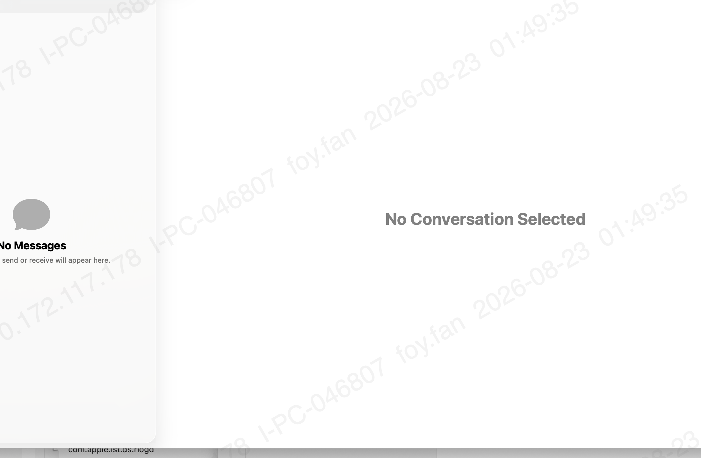

# BECVocab · 商务英语词汇



**BEC（Business English Certificate）中级 + 高级词汇学习 macOS App**

包含 **5578 个 BEC 核心词汇**，每个词都有 IPA 音标、中文释义、英文例句及中文翻译，是备考 BEC 和提升商务英语的得力工具。

---

## ✨ 功能

| 功能 | 说明 |
|------|------|
| 📖 **5578 词汇** | BEC 中级 + 高级全覆盖，按序浏览 |
| 🔊 **真人发音** | 自动朗读单词，支持点击例句发音 |
| 🌏 **例句翻译** | 5431 句例句已离线翻译为中文（Apple 本地翻译） |
| 🔍 **搜索** | 按英文或中文释义快速定位单词 |
| 📌 **书签进度** | 自动保存阅读进度，可一键跳转 |
| ⌨️ **键盘导航** | 空格发音，方向键/回车切换单词 |
| 🌈 **彩虹背景** | 渐变动态背景，视觉舒适 |

---

## 📦 安装

### 方式一：下载 Release（推荐）

从 [Releases](https://github.com/FoyFan/BECVocab/releases) 下载最新版 `BECVocab.app.zip`，解压后拖入 `应用程序` 文件夹即可。

> **注意**：首次打开可能提示"无法验证开发者"，前往 **系统设置 → 隐私与安全性 → 仍要打开** 即可。

### 方式二：自行编译

需要 macOS 14+ 和 Xcode 15+。

```bash
git clone https://github.com/FoyFan/BECVocab.git
cd BECVocab
swift build -c release
```

编译产物在 `.build/arm64-apple-macosx/release/BECVocab`，可使用以下命令打包为 .app：

```bash
mkdir -p BECVocab.app/Contents/MacOS BECVocab.app/Contents/Resources
cp .build/arm64-apple-macosx/release/BECVocab BECVocab.app/Contents/MacOS/
cp -R .build/arm64-apple-macosx/release/BECVocab_BECVocab.bundle BECVocab.app/Contents/Resources/
# 创建 Info.plist（见项目 Sources 模板）
```

---

## 🎮 使用

| 操作 | 效果 |
|------|------|
| **方向键 ← ↑** | 上一个单词 |
| **方向键 → ↓** | 下一个单词 |
| **空格键** | 朗读当前单词 |
| **回车键** | 切换到下一个单词 |
| **点击例句** | 朗读例句 |
| **搜索框** | 搜索英文或中文 |
| **侧边栏** | 浏览所有单词并跳转 |

---

## 🏗 项目结构

```
BECVocab/
├── Package.swift           # Swift Package Manager 配置
├── Sources/
│   ├── BECVocab/           # 主 App
│   │   ├── BECVocabApp.swift      # 入口
│   │   ├── Models/
│   │   │   └── Word.swift         # 单词模型
│   │   ├── Services/
│   │   │   ├── DataService.swift  # 数据加载、搜索、书签
│   │   │   └── SpeechService.swift # TTS 发音
│   │   ├── Views/
│   │   │   └── ContentView.swift  # 完整 UI
│   │   └── Resources/
│   │       └── bec_data.json      # 5578 词数据
│   └── TranslateTool/     # 例句翻译工具
│       └── main.swift
├── screenshot.png
└── README.md
```

---

## 🛠 技术栈

- **语言**：Swift 6
- **框架**：SwiftUI, AVSpeechSynthesizer, Translation (Apple 本地翻译)
- **平台**：macOS 14+
- **构建**：Swift Package Manager

---

## 👤 作者

**foy.fan@outlook.com**

---

## 📄 License

MIT